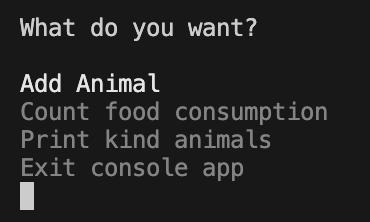

# minidz-1 КПО

Бабушкин В. А.

[условие](./КПО-мини-ДЗ_1.pdf)

## Принцип работы



При запуске проекта ***zoo-erp*** открывается меню взаимодействия с системой, в нем реализованы функциональные требования, прописанные в условии задания.

Но как было написано в условии, модель должна быть сделана под дальнейшее масштабирование, поэтому она имеет больше функций чем в функциональных требованиях в системе, хоть и не доступных из консольного UI.

## Ключевые особенности

### ZooOwnership

Было выбранно отказаться от интерфейса IInventory - нужного для принуждения каждой вещи своего индекса. Потому что было решено, что не только вещи, но и животные должны иметь свой индекс для удобной работы с ними.

Так был создан класс обертка ***ZooOwnership*** для связи собственности Зоопарка с ним самим.
По сути этот класс реализует принцип инверсии зависимостей - теперь зоопарк не зависит напрямую от животных и вещей.

Этот класс обладает приватным ключом ***_zooKey***, чтобы никакой другой класс кроме зоопарка не смог делать опасные операции с ним (к примеру обьект от собственности зоопарка).

Вначале была идея сделать этот класс ***интерфейсом***, но философия C# состоит до сих пор в том, что интерфейс - запротоколизированный способ работы с классами, поэтому в интерфейсах нельзя инициализировать переменные, что было крайне важно для ***ZooOwnership***

От него наследуются ***ZooAnimal*** и ***ZooThing***, которые как раз хранят завернутые обьекты.

### Zoo

Каждый обьект собственности зоопарка обладает уникальным номером, по которому можно его достать через определенные функции.

Было принято решение инкапсулировать все данные о собственности зоопарка, чтобы будущие программисты не могли по их желанию менять свойства внутренних обьектов. 

## Примененные принципы SOLID

### S - single responcibility

Так и есть, мои классы состоят только из нужных частей и совсем не перегружены. Самым большим конечно выглядит ***Zoo***, но он состоит из важных методов доступа к внутренним данным и их обработкой. Конечно, некоторые из них можно было вынести в отдельные интерфейсы, но наша программа это ERP система для ЗООПАРКА, поэтому такие методы как ***GetAnimalById*** точно нигде не смогут понадобится в других классах.

### O - Open/Closed Principe

Этот принцип как раз достигается инверсиями зависимости. Вот у меня в классе зоопарка хранятся обертки над животными. Потом, когда влиятельный бизнесмен пожертвует зоопарку капибару, мне не придется менять код ни класса зоопарка, ни класса обертки над животными. Достаточно будет только класс капибары унаследовать от ***Animal***

### L - Liskov substitution principe

Все мои классы вплоть до нижнего уровня абстрактные, с неопределенными виртуальными методами. Поэтому в моем коде даже не возникнет ситуации, где можно сравнить поведение родителя с сыном.

### I - Interface Segregation Principe

Все мои интерфейсы не больше 20 строк в файле.

### D - Dependency Inversion Principe

Помимо использования оберток для собственности зоопарка, я использовал DI-Container прямо в ```Main()```

```csharp
internal static void Main(){
    // DI Container of Clinic
    var services = new ServiceCollection().AddTransient<IClinic, Clinic>();
    services.AddTransient<Zoo>();

    using ServiceProvider serviceProvider = services.BuildServiceProvider();
    var zoo = serviceProvider.GetService<Zoo>();

    // Initing console app
    ConsoleApp consoleApp = new ConsoleApp(zoo);

    // Run program
    consoleApp.Run();

}
```


## Тестирование

Дополнение я реализовал проект тестирующий мою программу на базе NuGet пакета ```XUnit```.

Тесты в папке [XUnitTester](https://github.com/Babushkin05/software-dev-course/tree/main/hw1/XUnitTester)

В нем 11 тестов, покрывающих всю основную бизнес-логику программы, описанную в функциональных требованиях.