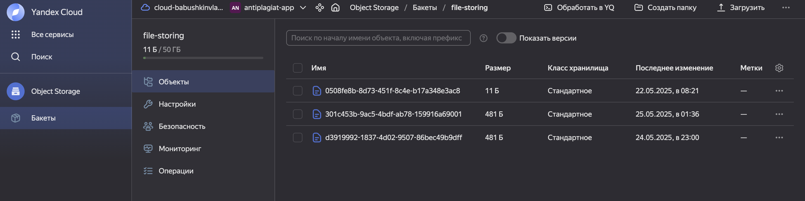

# КР 2 БАБУШКИН ВОВА

Микросервисное приложение для анализа текстов

## grpc
Я решил попробовать для себя технологию grpc, поэтому организовал общение микросервисов между собой через этот протокол

так, в каждом сервисе есть папка ***api*** в которой описаны proto-файлы - файлы описывающие интерфейс взаимодействия сервисов. С помощью кодогенерации в dockerfile из этих интерфейсов создается код, которым уже пользуются мои приложения (а конкретно /internal/infrastructure/grpc)

## s3

В таблице ответов, я увидел, что изначально вы хотели дать задание хранить данные в облачном хранилище s3. Я решил изучить эту тему, и нашел аналог от Яндекса - cloud object storage совместимый с s3 от amazon. Поэтому решил воспользоваться им. C помощью библиотеки "minio" я храню файлы в облаке. Также я все-таки развертываю postgres для хранения метаданных

## анализ текста

мне показалось интересным бы сделать не антиплагиат, а семантический анализ текста. Я нашел библиотеку "vader", которая это делает

## архитектура

каждый сервис обладает почти идентичной чистой архитектурой - 
```
analise-service
├── Makefile
├── api
│   ├── fileanalisys
│   │   └── file_analisys.proto
│   ├── filestoring
│   │   └── file_storing.proto
│   └── gen
│       ├── fileanalisys
│       │   ├── file_analisys.pb.go
│       │   └── file_analisys_grpc.pb.go
│       └── filestoring
│           ├── file_storing.pb.go
│           └── file_storing_grpc.pb.go
├── cmd
│   └── main.go
├── config
│   └── local.yaml
├── deployments
│   └── Dockerfile
├── go.mod
├── go.sum
└── internal
    ├── application
    │   ├── ports
    │   │   ├── input
    │   │   │   └── analisys_usecase.go
    │   │   └── output
    │   │       ├── sentiment_analyzer.go
    │   │       ├── storing_client.go
    │   │       └── wordcloud_generator.go
    │   └── services
    │       └── analisys_service.go
    ├── config
    │   └── config.go
    ├── domain
    │   └── entities
    │       └── analisys_result.go
    └── infrastructure
        ├── analisys
        │   ├── vader_adapter.go
        │   └── wordcloud_adapter.go
        └── grpc
            ├── server.go
            └── storing_client.go
```

## запуск

```
обратите внимание, что без .env в котором указаны ключи для доступа в s3 не запустится storage-service и за ним упадет все
```

```
docker-compose build
docker-compose up
```

в ***docker-compose.yaml*** я вызываю соответствующие файлы моих микросервисов.

## пример работы

при запуске в логах сразу видим краткую документацию по api для api-gateway:

```
api-gateway      |  - using env:        export GIN_MODE=release
api-gateway      |  - using code:       gin.SetMode(gin.ReleaseMode)
api-gateway      | 
api-gateway      | [GIN-debug] POST   /upload                   --> github.com/Babushkin05/software-dev-course/kr2/api-gateway/internal/presentation/service_http/handlers.(*FileHandler).Upload-fm (3 handlers)
api-gateway      | [GIN-debug] POST   /analyze/:file_id         --> github.com/Babushkin05/software-dev-course/kr2/api-gateway/internal/presentation/service_http/handlers.(*FileHandler).Analyze-fm (3 handlers)
api-gateway      | [GIN-debug] GET    /download/:file_id        --> github.com/Babushkin05/software-dev-course/kr2/api-gateway/internal/presentation/service_http/handlers.(*FileHandler).Download-fm (3 handlers)
api-gateway      | [GIN-debug] GET    /wordcloud/:file_id       --> github.com/Babushkin05/software-dev-course/kr2/api-gateway/internal/presentation/service_http/handlers.(*FileHandler).WordCloud-fm (3 handlers)
```

## в качестве тестового файла, использую до слез текст о том как С.А. Виденин не вернул книжку в библиотеку:

```
To be honest, it's much worse there 🙈 I've been living with this burden for 17 years... Maybe if I tell you, it will make me feel better?

Actually, a professor, my academic supervisor, took this book from the university library for me. The book was only for work in the reading room... He took it for me on his own responsibility (I was writing a dissertation and I needed to touch on the history of computer science).

I promise to go to Krasnoyarsk this summer and return it.
```

### загрузить файл в облако

```
curl -X POST http://localhost:8080/upload -F "file=@testfile.txt"
```

получаю результат:

```
{"file_id":"301c453b-9ac5-4bdf-ab78-159916a69001"}
```
это uuid который мне сгенерировала библиотека от гугла, с таким айди теперь хранится текст в yandex cloud object storage



как видим в ui - действительно сохранился

### выгрузить файл

```
curl -X GET http://localhost:8080/download/301c453b-9ac5-4bdf-ab78-159916a69001 -o downloaded.txt
```

и действительно, [скачалось](./test/downloaded.txt)

### анализ текста

```
curl -X POST http://localhost:8080/analyze/301c453b-9ac5-4bdf-ab78-159916a69001
```

получаем в консоли результат
```
Positive: 5.86%, Negative: 6.28%, Neutral: 87.87%, Compound: -0.1027%  
```

### облако слов

```
curl -X GET http://localhost:8080/wordcloud/301c453b-9ac5-4bdf-ab78-159916a69001 -o cloud.png
```
важно указать png, в текущей версии генерируется только картинка такого формата

результат


конечно, это апи рисует не лучшим образом, но зато бесплатное и без ограничений


## итог

Вообще, изначально хотел еще и сделать in-momory бд для хранения кэша в analisys-service, но как-то и так трудозавтратно вышло)

Еще прикол - из-за того что я в английском путаюсь, я писал то analisys-service то analise-service то analysis-service и из-за этого потратил 2 часа на дебаг, потому что сервисы не видели друг друга)) (искали под чужими именами)

тесты не писал.